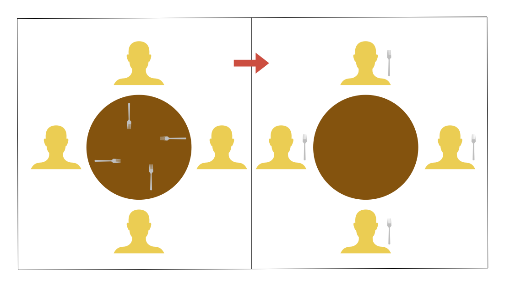

# Algorithm Study - Banker's Algorithm
> 본 내용은 알고리즘을 공부하면서 정리한 글 입니다.

</br>
</br>

## 알고리즘 개요
둘 이상의 스레드가 서로 상대방의 작업이 끝나기 만을 기다리는 '교착 상태(Deadlock)'가 발생 할 수 있다. '다익스트라(Dijkstra)'가 고안한 'Banker's Algorithm'은 교착 상태를 `회피`하기 위한 알고리즘이다.

</br>
</br>

## 알고리즘 구현
- 비유 </br>
기업A와 기업B가 각각 1,500만원 2,000만원을 대출하려 할때 <b>은행원이 대출을 승인하기 전에 미리 결정된 모든 자원의 최대 가능한 할당량을 시뮬레이션하여 안전 여부를 검사한 후 자원을 배분한다.</b>

</br>
</br>

## 직접 구현해 보기
'다카노 유키 - 동시성 프로그래밍'책을 참고하여 Rust로 알고리즘을 구현해 보았다.

</br>

#### 예시 상황 <b>(식사하는 철학자 문제)</b>
> 4명의 철학자(Thread)가 테이블 양 옆에 놓인 2개의 포크(Lock)를 들어 음식을 먹는 상황이다. 철학자가 테이블에 놓인 음식을 다 먹을 수 있도록 프로그래밍 해보자.

</br>

#### examples/algorithm_ex_0.rs
```Rust
...

philosophers.push(thread::spawn(move || {
    while *foods.lock().unwrap() > 0 {
        let left_fork = forks[(id + 0) % MAX_FORKS].lock().unwrap();
        let right_fork = forks[(id + 1) % MAX_FORKS].lock().unwrap();

        let mut foods = foods.lock().unwrap();
        if *foods > 0 {
            *foods -= 1;
            println!("철학자 {}번은 {}번과 {}번 포크로 음식을 먹었다. (남은 음식량:{})", id, *left_fork, *right_fork, *foods);
        }
    }
}));

...

```
> 실행결과:
>> ... </br>
>> 철학자 0번은 0번과 1번 포크로 음식을 먹었다. (남은 음식량:99923) </br>
>> 철학자 0번은 0번과 1번 포크로 음식을 먹었다. (남은 음식량:99922) </br>
>> 철학자 0번은 0번과 1번 포크로 음식을 먹었다. (남은 음식량:99921) </br>
>>
>> (내용은 실행 할 때마다 달라지지만, 더 이상 프로그램이 동작하지 않는다.) </br>

</br>

프로그램이 실행하는 도중에 멈추게 된다. 그 이유는 프로그램 실행 도중 스레드간 '교착 상태(Deadlock)'에 빠지기 때문이다. 



##### 대략 이런상태 이다...

</br>
</br>

정상적으로 작동 되게 하는 방법은 여러 방법이 있다. 그 중에서 교착 상태를 `회피`하는 다익스트라(Dijkstra)의 은행원 알고리즘(Banker's Algorithm)을 사용해 보았다.

#### examples/algorithm_ex_1.rs
```Rust
...

fn is_safe(&self) -> bool {
    let mut finish = [false; NTH]; // 스레드 i는 리소스 획득과 반환에 성공했는지 여부
    let mut work = self.available.clone(); // 이용 가능한 리소스의 시뮬레이션 값

    loop {
        // 모든 스레드 i와 리소스 j에 대해
        // finish[i] == false && work[j] >= need(i, j)를 만족하는 스레드를 찾는다.
        // 이때 need(i, j)는 (self.max[i][j] - self.allocation[i][j])
        let mut found = false;
        let mut num_true = 0;
        for (i, alloc) in self.allocation.iter().enumerate() {
            if finish[i] {
                num_true += 1;
                continue;
            }

            let need = self.max[i].iter().zip(alloc).map(|(m, a)| m - a);
            let is_avail = work.iter().zip(need).all(|(w, n)| *w >= n);
            if is_avail {
                // 스레드 i가 리소스 확보 가능
                found = true;
                finish[i] = true;
                for (w, a) in work.iter_mut().zip(alloc) {
                    *w += a; // 스레드 i가 현재 확보하고 있는 리소스 반환.
                }
                break;
            }
        }

        if num_true == NTH {
            // 모든 스레드가 리소스 확보 가능하면 안전함.
            return true;
        }

        if !found {
            // 스레드가 리소스를 확보할 수 없음.
            break;
        }
    }
    false
}

...
```

안정 상태인지, 불안정 상태인지 검사하는 이 코드가 핵심이라고 생각한다. </br>
안전한 경우에만 리소스를 확보하여 교착 상태를 회피한다. 
스레드는 처리를 마치는 즉시 반드시 리소스를 반환해야 한다.

</br>

> 실행결과:
>> ... </br>
>> 철학자 3번은 3번과 0번 포크로 음식을 먹었다. (남은 음식량:2) </br>
>> 철학자 3번은 3번과 0번 포크로 음식을 먹었다. (남은 음식량:1) </br>
>> 철학자 3번은 3번과 0번 포크로 음식을 먹었다. (남은 음식량:0) </br>
>> 잘 먹었습니다. </br>
>>
>> (내용은 실행 할 때마다 달라지지만, 철학자들은 음식을 남김없이 모두 먹었다.) </br>
